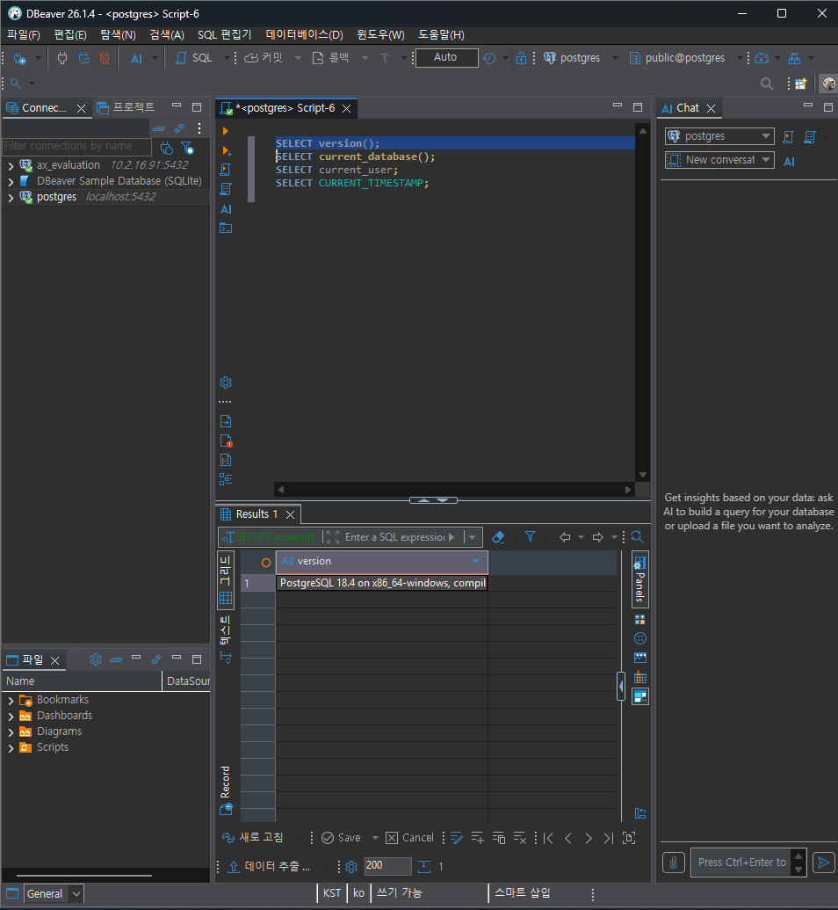
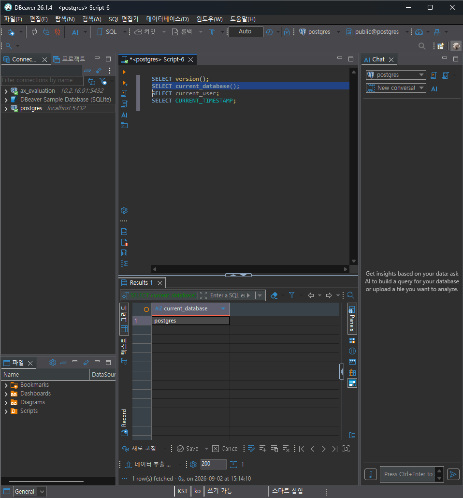
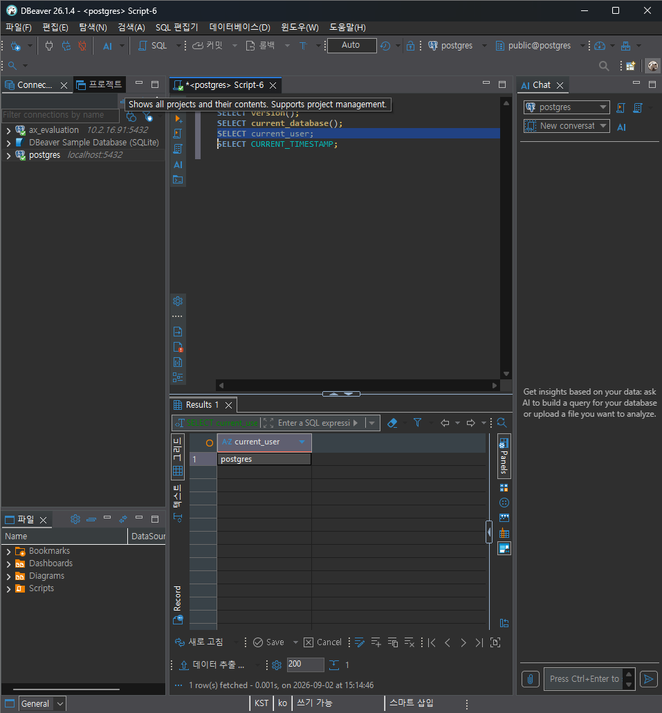
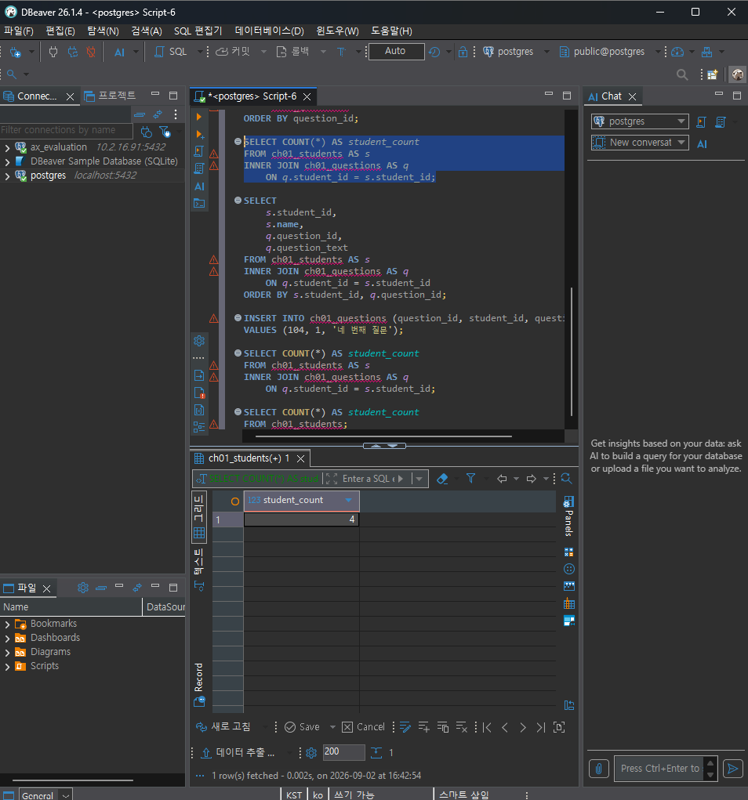
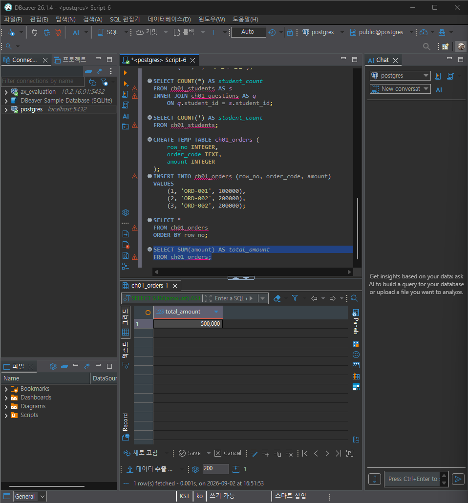

# Chapter 01 확장 실습 답안 템플릿

> **과제:** AI 시대에 데이터베이스를 왜 배워야 하는가  
> **사용 방법:** 이 파일을 내려받아 **본인의 GitHub 저장소**에 `chapter01_answer.md`라는 이름으로 저장한 뒤 답안을 작성합니다.  
> **제출 방법:** LMS에는 파일을 업로드하지 않고, **본인 GitHub 저장소의 `chapter01_answer.md` 파일 URL**을 제출합니다.

---

## 0. 학생 정보

| 항목 | 작성 내용 |
| --- | --- |
| 학번 | 없음 |
| 이름 | 정다라 |
| GitHub 계정 | https://github.com/darajeong |
| 과제 작성일 | 2026.09.02. |
| 사용한 AI 도구 | GPT |

> 실제 비밀번호, API Key, 전체 DB 접속 URL, 개인정보는 이 파일이나 캡처 화면에 기록하지 않습니다.

---

# 1. PostgreSQL 실행 환경 확인

## 1-1. 실행한 SQL

```sql
SELECT version();
SELECT current_database();
SELECT current_user;
SELECT CURRENT_TIMESTAMP;
```

## 1-2. 실행 결과 기록

```text
PostgreSQL 버전: PostgreSQL 18.4 on x86_64-windows, compiled by msvc-19.44.35227, 64-bit
현재 데이터베이스: postgres
현재 사용자: postgres
현재 시각: 2026-09-02 14:54:24.623 +0900
```

## 1-3. 내가 확인한 내용

1. SQL을 작성하는 프로그램과 PostgreSQL은 같은 프로그램인가요?

```text
나의 답: 아니요. DBeaver는 SQL을 작성하고 실행 요청을 보내는 도구이고, PostgreSQL은 데이터를 저장하고 SQL을 실제로 처리하는 데이터베이스 관리 시스템입니다.
```

2. `current_database()` 결과는 무엇을 의미하나요?

```text
나의 답: 현재 PostgreSQL에서 접속하여 사용하고 있는 데이터베이스의 이름을 의미합니다.
```

3. SQL이 실행되었다는 사실만으로 데이터 내용도 올바르다고 할 수 있나요?

```text
나의 답: 아니요. SQL이 오류 없이 실행되었더라도 중복되거나 누락된 데이터가 있을 수 있고, SQL이 질문의 의도와 다르게 작성되었을 수도 있습니다. 따라서 예상 결과와 실제 결과를 비교하고 데이터의 의미까지 확인해야 합니다.
```

## 1-4. 증거 화면

아래 경로에 캡처 이미지를 저장하는 것을 권장합니다.

```text
assignments/chapter01/images/step01_environment.png
```

이미지를 저장했다면 아래 링크의 파일명을 실제 파일명에 맞게 수정합니다.

```markdown

```

**이미지 삽입 위치:**

<!-- 아래 줄의 주석을 지우고 실제 이미지 Markdown을 넣어도 됩니다. -->




---

# 2. Chapter 01 핵심 내용 복습

교재 문장을 그대로 복사하지 말고 자신의 말로 작성합니다.

| 본문의 핵심 | 나의 설명 |
| --- | --- |
| AI가 SQL을 만들어도 DB를 배워야 한다 | DB를 읽고 해석하는 것은 나이기 때문에 AI에 의존하면 안된다. |
| 데이터 구조가 중요하다 | 데이터를 어떤 기준으로 나누고 연결했는지에 따라 결과가 달라질 수 있다. |
| SQL 결과를 검증해야 한다 | 오류없이 실행되더라도 잘못된 대상을 세거나 일부 데이터를 빠뜨릴 수 있다. |
| 데이터 품질이 AI 답변 품질에 영향을 준다 | 원본 데이터에 중복, 누락, 오류가 있으면 AI도 그 데이터를 바탕으로 부정확한 분석을 만들 수 있기 때문이다. |
| 저장 방식은 데이터 양만 보고 선택하지 않는다 | 데이터 양뿐 아니라 여러 사람의 동시 수정, 권한, 반복 조회, 변경 이력, 백업과 복구도 고려해야 하기 때문이다. |

## 가장 중요하다고 생각한 한 문장

```text
AI는 주어진 질문과 데이터를 바탕으로 답을 생성하므로, 사용자가 상황과 요구사항을 구체적으로 설명해야 한다.
```

---

# 3. 실행 성공과 결과 정확성의 차이

## 3-1. SQL 실행 전 예상

학생 A는 질문 2개, 학생 B는 질문 1개, 학생 C는 질문이 없습니다.

```text
전체 학생 수: 3 명
전체 질문 수: 3 개
질문이 있는 학생 수: 2 명
질문이 없는 학생 수: 1 명
```

## 3-2. 임시 테이블 생성 및 데이터 입력 완료 확인

- [x] `ch01_students` 생성
- [x] `ch01_questions` 생성
- [x] 학생 3명 입력
- [x] 질문 3건 입력
- [x] 두 테이블의 데이터를 직접 조회

## 3-3. 잘못된 학생 수 SQL 실행 결과

실행한 SQL:

```sql
SELECT COUNT(*) AS student_count
FROM ch01_students AS s
INNER JOIN ch01_questions AS q
    ON q.student_id = s.student_id;
```

실행 결과:

```text
3
```

## 3-4. JOIN 상세 결과 관찰

```text
학생 A가 나타난 행 수: 2
학생 B가 나타난 행 수: 1
학생 C가 나타난 행 수: 0
```

다음 질문에 답합니다.

### Q1. 학생 C가 왜 결과에서 사라졌나요?

```text
INNER JOIN은 두 테이블에서 연결되는 데이터가 있는 경우만 결과에 포함합니다. 학생 C는 작성한 질문이 없어 질문 테이블과 연결되는 행이 없으므로 결과에서 사라졌습니다.
```

### Q2. 학생 A가 왜 여러 행으로 나타났나요?

```text
학생 A가 질문을 2개 작성했기 때문입니다. 학생 정보가 각각의 질문과 한 번씩 연결되어 학생 A가 2개의 결과 행으로 나타났습니다.
```

### Q3. 위 `COUNT(*)`가 실제로 세고 있었던 것은 무엇인가요?

```text
전체 학생 수가 아니라 학생 테이블과 질문 테이블을 INNER JOIN한 뒤 만들어진 결과 행의 수를 세고 있었습니다.
```

### Q4. 결과 숫자가 우연히 실제 학생 수와 같아도 바로 믿으면 안 되는 이유는 무엇인가요?

```text
SQL이 오류 없이 실행되더라도 요구사항과 다른 대상을 셀 수 있고, 일부 학생이 누락되거나 한 학생이 중복될 수 있습니다. 따라서 결과 숫자가 우연히 실제 학생 수와 같더라도 올바른 계산이라고 판단할 수 없습니다.
```

## 3-5. 질문 한 건을 추가한 뒤 다시 실행

추가한 데이터:

```text
학생 A가 작성한 네 번째 질문 1건
```

다시 실행한 결과:

```text
AI SQL 결과: 4
실제 학생 수: 3
```

### 결과 해석

```text
데이터가 바뀐 뒤 무엇이 달라졌는지: 학생 A의 질문 데이터가 한 행 추가되어, INNER JOIN 결과 행 수가 3개에서 4개로 늘어났다.

실제 학생 수는 왜 그대로인지: 기존 학생 A가 질문을 한 번 더 작성했을 뿐, 새로운 학생이 추가된 것은 아니므로 실제 학생 수는 여전히 3명이다.

이 실험을 통해 알게 된 점: SQL이 오류 없이 실행되더라도 요구사항에 맞는 값을 계산했는지 확인해야 한다. SQL이 무엇을 세고 있는지 살펴보고 예상값과 실행 결과를 비교해야 한다
```

## 3-6. 학생 테이블을 직접 센 결과

```sql
SELECT COUNT(*) AS student_count
FROM ch01_students;
```

결과:

```text
3
```

### 두 SQL의 차이를 내 말로 설명

```text
첫 번째 SQL은 전체 학생 수가 아니라 학생과 질문을 INNER JOIN한 결과 행 수를 세고 있었다. 따라서 한 학생이 질문을 여러 개 작성하면 그 학생이 여러 번 계산되고, 질문이 없는 학생은 제외된다.

두 번째 SQL은 학생 테이블의 행 수를 세므로 질문 작성 여부와 관계없이 전체 학생 수를 계산한다.

따라서 SQL을 검토할 때는 문법보다 먼저
'SQL이 실제로 무엇을 세고 있는지'를 확인해야 한다.
```

## 3-7. 증거 화면

권장 경로:

```text
assignments/chapter01/images/step03_join_result.png
```

`여기에 STEP 3 핵심 증거 화면을 삽입하세요.`

---

# 4. 잘못된 데이터가 결과를 바꾸는 과정

## 4-1. 주문 데이터 확인

다음 데이터를 입력한 뒤 실제 결과를 확인합니다.

```text
ORD-001, 100000
ORD-002, 200000
ORD-002, 200000
```

## 4-2. 실행 전 예상

업무적으로 주문이 `ORD-001`, `ORD-002` 두 건이고 `order_code`가 주문을 고유하게 구분한다고 **가정할 경우** 예상 합계:

```text
300,000 원
```

> 위 가정 자체가 실제 업무 규칙인지 확인해야 한다는 점도 기억합니다.

## 4-3. SQL 합계

```sql
SELECT SUM(amount) AS total_amount
FROM ch01_orders;
```

실제 결과:

```text
500,000 원
```

## 4-4. 결과 해석

### `SUM` 문법 자체가 잘못된 것인가요?

```text
아니요. SUM은 데이터베이스에 저장된 세 행의 금액을 정확하게 더했습니다.
```

### 결과 차이의 원인은 무엇인가요?

```text
ORD-002가 두 번 저장되어 있기 때문입니다. order_code가 주문을 고유하게 구분한다는 업무 규칙을 적용하면 중복일 수 있지만, SQL은 저장된 세 행을 모두 정상적인 데이터로 보고 합산했습니다.
```

### SQL이 정확하게 실행되어도 업무 숫자가 잘못될 수 있는 이유를 설명하세요.

```text
SQL은 저장된 데이터와 작성된 명령에 따라 계산할 뿐, 중복 여부와 같은 업무 규칙을 스스로 판단하지 못합니다. 따라서 중복되거나 잘못된 데이터가 저장되어 있으면 SQL이 정확하게 실행되어도 업무적으로 잘못된 결과가 나올 수 있습니다.
```

## 4-5. AI에게 같은 데이터를 분석시킨 결과

AI가 계산한 합계:

```text
500,000원
```

AI가 중복 가능성을 언급했나요?

```text
아니요.
```

AI가 `ORD-002` 두 행이 실제 두 주문인지 중복 입력인지 스스로 확정할 수 있나요? 이유도 적으세요.

```text
아니요. 주어진 데이터만으로는 같은 주문 코드가 여러 행으로 저장될 수 있는지 알 수 없기 때문입니다. 실제 두 주문인지 중복 입력인지 판단하려면 주문 코드에 관한 업무 규칙을 추가로 확인해야 합니다.
```

추가로 확인해야 할 업무 규칙:

```text
1. 주문 한 건을 고유하게 구분하는 값인가?
2. 하나의 주문 코드가 여러 행으로 저장될 수 있는가?
3. 같은 주문 코드가 반복되면 별개의 주문으로 볼 것인가, 중복 입력으로 볼 것인가?
```

내가 최종적으로 내린 판단:

```text
현재 저장된 세 행을 그대로 합산하면 총액은 500,000원이다. 그러나 order_code가 주문을 고유하게 구분하고 ORD-002가 중복 입력된 것이라면 실제 주문 금액은 300,000원이다. 따라서 업무 규칙과 원본 데이터를 확인하기 전에는 어느 금액이 정확한지 확정할 수 없다.
```

## 4-6. 증거 화면

권장 경로:

```text
assignments/chapter01/images/step04_duplicate_result.png
```

`여기에 STEP 4 핵심 증거 화면을 삽입하세요.`

---

# 5. 파일·스프레드시트·DBMS 선택 연습

각 사례에 대해 **AI에게 묻기 전에 먼저 본인의 판단을 작성**합니다.

## 사례 A. 개인 독서 기록

```text
나의 선택:스프레드시트
선택 이유:혼자 사용하는 것이고 한달에 5건 정도면 탭을 이용해서 연간으로 기록하면 한눈에 알아보기 쉽기 때문입니다.
어떤 조건이 추가되면 다른 방식으로 바꿀 것인지: 개인 독서 기록에서 어떤 조건이 추가되더라도 다른 방식으로 바꾸지 않을 것 같다. 스프레드시트는 모바일로도 쉽게 확인가능하고 수정도 편리하기 때문이다.
```

## 사례 B. 동아리 행사 신청 명단

```text
나의 선택:스프레드 시트
선택 이유:동아리 사람들에게 아무래도 익숙한 스프레드 시트가 좋을것 같다. 또 수정도 편리하고 참석률도 쉽게 구할 수 있다.
어떤 조건이 추가되면 다른 방식으로 바꿀 것인지:동아리 모임이 코딩 모임이고, 단기간이 아닌 장기간이라면 DBMS를 이용할수도 있을 것 같다.
```

## 사례 C. 온라인 강의 서비스

```text
나의 선택:DBMS
선택 이유:반복해서 조회하고 여러 사용자가 동시에 사용한다고 하니 충돌이 날 수 있고, 권한과 복구가 중요하니 DBMS를 선택하겠다.
어떤 조건이 추가되면 다른 방식으로 바꿀 것인지: 학생이 2명이면 인원이 적으니 충돌이 날 확률도 적으니 스프레드 시트로 바꾸겠다. 
```

## 판단 기준 체크

- [X] 데이터 증가
- [X] 여러 사용자의 동시 수정
- [X] 데이터 사이의 관계
- [X] 반복 조회와 집계
- [X] 정확성·일관성
- [X] 변경 이력
- [X] 권한 구분
- [X] 백업·복구
- [X] 웹·앱에서 지속 사용

### 데이터가 적으면 무조건 스프레드시트를 사용해야 하나요?

```text
나의 답: 아니요. 데이터가 적더라도 여러 사람이 동시에 수정하거나 데이터의 정확성, 보안, 권한 관리가 중요하다면 스프레드시트보다 DBMS가 더 적합할 수 있습니다.
```

---

# 6. 나만의 서비스 데이터 구조 초안

> 이 내용은 이후 Chapter에서 계속 확장할 수 있으므로 신중하게 작성합니다.

## 6-1. 서비스 정의

```text
서비스 이름: 학생 상담

이 서비스는 학생 상담하기 위한 서비스이다.
```

## 6-2. 관리할 데이터 후보

```text
1. 학생
2. 강사
3. 상담
4. 상담신청
5. 신청 상태
```

## 6-3. 한 행의 의미

| 데이터 후보 | 한 행의 의미 |
| --- | --- |
| 학생 데이터 한행 | 학생 한 명 |
| 상담 데이터 한행 | 상담 한 개 |
| 상담 데이터 한행 | 학생이 특정 상담을 신청한 사건 한 건 |

## 6-4. 관계를 자연어로 설명

```text
1. 한 학생은 여러 상담을 신청할 수 있다.
2. 한 상담에는 여러 학생이 신청할 수 있다.
3. 한 학생과 한 상담을 연결한다.
```

## 6-5. 아직 결정하지 않은 정책

```text
Q1. 회원 이메일은 반드시 고유해야 하는가?
Q2. 탈퇴 회원 기록은 삭제하는가?
Q3. 취소 상담도 분석에 포함되는가?
```

> 확정되지 않은 정책을 AI가 임의로 결정한 경우 그대로 받아들이지 않습니다.

---

# 7. AI를 검토자로 활용하기

## 7-1. 내가 AI에게 전달한 핵심 프롬프트

개인정보나 비밀번호 등 민감한 내용은 제거한 뒤 기록합니다.

```text
나는 데이터베이스를 처음 배우는 학생입니다.
아직 ERD나 정규화를 배우기 전입니다.
내가 생각한 서비스는 다음과 같습니다.
서비스: [학생 상담]

목적: [학생 정보와 상담 이력을 안전하게 보관하고 조회하기]

관리할 데이터 후보:

- [학생 데이터 한행]

- [상담 데이터 한행]

- [상담 데이터 한행]

내가 생각한 관계:

- [학생 한 명]

- [상담 한 개]

아직 결정하지 못한 정책:

- [회원 이메일은 반드시 고유해야 하는가?]

- [탈퇴 회원 기록은 삭제하는가?]

- [취소 상담도 분석에 포함되는가?]

지금 단계에서는 완성된 SQL을 만들지 말고,
1. 내가 놓친 데이터가 있는지,
2. 서로 다른 의미의 데이터를 한 항목으로 섞은 것은 없는지,
3. 추가로 확인해야 할 업무 질문은 무엇인지,
4. 파일·스프레드시트·관계형 DBMS 중 무엇이 적합해 보이는지
초보자가 이해할 수 있게 검토해 주세요.
확정되지 않은 정책은 임의로 정답처럼 결정하지 마세요.
```

## 7-2. AI의 주요 제안과 나의 판단

최소 5개를 작성합니다.

| AI의 제안 | 수용 / 수정 / 거절 | 나의 판단 근거 |
| --- | --- | --- |
| 상담 기록은 누가 조회하고 수정할 수 있는가? | 수용 | 학생도 조회가능한지 강사만 조회가능하도록 할지 정하지 않았다. |
| 상담 기록을 얼마 동안 보관할 것인가? | 수용 | 얼마 동안 보관할 것인지 정하지 않았다. |
|  |  |  |
|  |  |  |
|  |  |  |

## 7-3. AI에게 자기 답변을 다시 비판하도록 요청한 결과

첫 번째 답변과 달라진 점:

```text
'JOIN 이후 행의 의미가 달라질 수 있다는 점이 빠졌습니다.'
```

AI가 처음에 임의로 가정했던 내용:

```text
생략함
```

추가로 업무 담당자에게 확인해야 한다고 판단한 내용:

```text
학생 테이블에서 한 행은 학생 한 명일 수 있지만, 학생과 상담을 합치면 한 행은 보통 학생 한 명이 아니라 학생과 상담 한 건의 연결을 의미합니다.
학생 A가 상담을 세 번 받았다면 JOIN 결과에서 학생 A가 세 줄로 나타날 수 있고, INNER JOIN을 사용하면 상담받지 않은 학생은 빠질 수 있습니다.
따라서 다음 질문도 포함했어야 합니다.
- 전체 학생 수, 상담받은 학생 수, 상담 건수 중 무엇을 세려는가?
- 학생과 상담을 합친 결과에서 한 행은 무엇을 의미하는가?
- 상담받지 않은 학생도 결과에 포함해야 하는가?
```

## 7-4. AI 활용에 대한 나의 평가

```text
가장 유용했던 부분: 비판하기를 통해 생각하지 못했던 부분을 추가로 제안해줌

수정하거나 거절한 부분: 상담 기록을 얼마 동안 보관할 것인가? (수용)

그렇게 판단한 근거: 얼마 동안 보관할 것인지 정하지 않았다.

AI가 없었다면 놓쳤을 가능성이 있는 질문: 상담 기록을 얼마 동안 보관할 것인가?
```

## 7-5. AI 활용 증거 화면

권장 경로:

```text
assignments/chapter01/images/step07_ai_review.png
```

AI 대화 전체를 캡처할 필요는 없습니다. 핵심 요청과 검토 과정이 보이는 화면 1장 정도면 충분합니다.

`여기에 AI 활용 증거 화면을 삽입하세요.`

---

# 8. 기준 데이터·파생 데이터·AI 생성 결과 구분

내 서비스에 맞게 작성합니다.

| 구분 | 내 서비스의 예 | 판단 이유 |
| --- | --- | --- |
| 기준 데이터 | 학생 기본 정보, 상담 일시, 상담 담당자, 상담 상태, 실제 상담 기록 | 학생과 상담 업무에서 실제로 입력·저장되며, 다른 통계와 판단의 공식적인 근거로 사용되는 데이터이기 때문입니다. |
| 파생 데이터 | 학생별 상담 횟수, 월별 상담 건수, 상담 완료율, 취소율 | 기준 데이터에 저장된 상담 기록과 상태를 집계하거나 계산해서 만든 결과이기 때문입니다. |
| AI 생성 결과 | 상담 내용 요약, 상담 주제 자동 분류, 후속 상담 필요 여부 추천 | AI가 상담 기록과 사용자의 지시를 바탕으로 생성한 결과이며, 틀릴 수 있으므로 담당자의 확인 없이 공식 기준 데이터로 사용하면 안 되기 때문입니다. |

### 기준 데이터가 변경되면 파생 데이터는 어떻게 해야 하나요?

```text
기준 데이터가 변경되면 파생 데이터도 변경된 내용을 반영해 다시 계산하거나 갱신해야 합니다.
```

### AI 결과만 있고 원본 데이터가 없다면 결과를 충분히 검증할 수 있나요?

```text
아니요. 원본 데이터를 보관하고 AI 결과와 비교할 수 있어야 하며, 중요한 결정에는 담당자의 확인이 필요합니다.
```

---

# 9. 최종 성찰

아래 세 문장은 반드시 **본인의 말**로 작성합니다.

```text
1. SQL이 실행되어도 결과를 바로 믿으면 안 되는 이유는 문법이 맞아도 조회 조건이나 JOIN 방식이 잘못되어 의도와 다른 결과가 나올 수 있기 때문이다.

2. AI를 데이터베이스 학습에 활용할 때 가장 중요한 것은 AI의 답을 그대로 믿지 않고 원본 데이터와 업무 기준을 바탕으로 직접 검증하는 것이다.

3. 이번 실습 이후 내가 더 확인하고 싶은 것은 JOIN 이후 한 행의 의미가 어떻게 달라지고, 학생 수와 상담 건수를 정확히 구분하는 방법이다.
```

## 이번 Chapter에서 새롭게 알게 된 점 3가지

```text
1.SQL이 오류 없이 실행되더라도 JOIN 방식이나 조회 조건이 잘못되면 결과의 의미가 달라질 수 있다는 점을 새롭게 알게 되었다.
2.기준 데이터가 변경되면 이를 계산해 만든 파생 데이터도 다시 계산하거나 갱신해야 한다는 점을 알게 되었다.
3.AI가 생성한 결과는 원본 데이터가 있어야 정확성을 검증할 수 있으며, 중요한 판단에는 사람의 확인이 필요하다는 점을 알게 되었다.
```

## 아직 이해가 명확하지 않은 부분

```text
1.INNER JOIN, LEFT JOIN 등 JOIN 방식에 따라 결과에 포함되는 데이터와 한 행의 의미가 어떻게 달라지는지 아직 명확하지 않다.
2.기준 데이터가 변경될 때 파생 데이터를 언제, 어떤 방식으로 다시 계산하고 갱신해야 하는지 아직 명확하지 않다.
```

---

# 10. 제출 전 자기 점검

- [X] PostgreSQL 실행 화면을 확인했다.
- [X] SQL 실행 전에 예상 결과를 먼저 작성했다.
- [X] `INNER JOIN` 예제에서 누락과 반복을 설명할 수 있다.
- [X] 숫자가 우연히 같아도 의미가 다를 수 있음을 설명했다.
- [X] 중복 데이터가 집계 결과에 미치는 영향을 확인했다.
- [X] 저장 방식을 데이터 양만으로 판단하지 않았다.
- [X] 개인 서비스 주제를 하나 정했다.
- [X] 데이터 후보와 한 행의 의미를 작성했다.
- [X] 미확정 정책을 최소 3개 작성했다.
- [X] AI 제안을 수용·수정·거절로 구분했다.
- [X] AI 제안에 대한 판단 근거를 작성했다.
- [X] 기준 데이터·파생 데이터·AI 결과를 구분했다.
- [X] 핵심 증거 이미지가 Markdown에서 정상적으로 보인다.
- [X] 비밀번호·API Key·개인정보가 노출되지 않았다.

---

# 11. LMS 제출 정보

## 내 GitHub 답안 파일 URL

아래에는 **교수자 템플릿 URL이 아니라 본인이 작성한 답안 파일의 GitHub URL**을 기록합니다.

```text
https://github.com/darajeong/ai-database-study/blob/main/assignments/chapter01/chapter01_answer.md
```

내 실제 제출 URL:

```text
https://github.com/darajeong/ai-database-study/blob/main/assignments/chapter01/chapter01_answer.md
```

> LMS에는 위 **본인 저장소의 `chapter01_answer.md` 파일 URL 하나**를 제출합니다.

---

## 권장 학생 저장소 구조

```text
<본인-저장소>/
└── assignments/
    └── chapter01/
        ├── chapter01_answer.md
        └── images/
            ├── step01_environment.png
            ├── step03_join_result.png
            ├── step04_duplicate_result.png
            └── step07_ai_review.png
```

이 구조를 사용하면 이후 Chapter 02, Chapter 03도 같은 방식으로 계속 추가할 수 있습니다.
