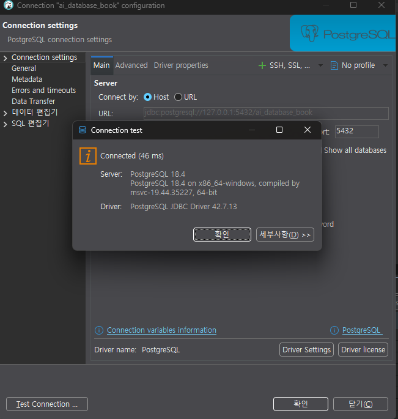
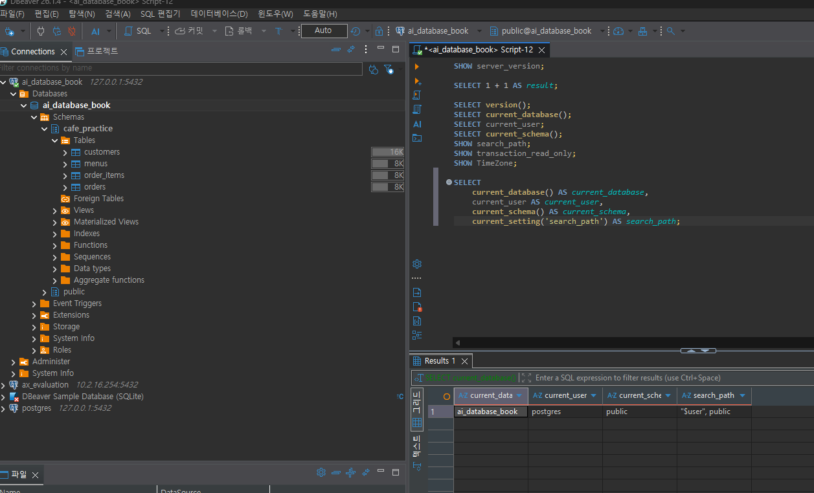

# Chapter 03 확장 실습 답안 템플릿

> **과제:** PostgreSQL과 DBeaver로 실습 환경 검증하기  
> **사용 방법:** 이 파일을 내려받아 본인의 GitHub 저장소에 `chapter03_answer.md`라는 이름으로 저장한 뒤 실습하면서 바로 작성합니다.  
> **제출 방법:** LMS에는 파일을 직접 업로드하지 않고, **본인 GitHub 저장소의 `chapter03_answer.md` 파일 URL**을 제출합니다.

---

## 제출 전 보안 주의

이 과제 파일과 캡처 화면에는 다음 정보를 올리지 않습니다.

```text
실제 PostgreSQL 비밀번호
전체 DB 접속 URL
API Key / Token
개인정보
공개할 필요가 없는 사내 서버 주소
```

LMS에서 제출자를 확인할 수 있으므로 공개 저장소의 답안 파일에 학번이나 실명을 반드시 적을 필요는 없습니다.

```text
GitHub 계정 또는 별칭:
과제 작성일:
사용한 AI 도구:
```

---

# 1. PostgreSQL과 DBeaver 환경 확인

## 1-1. 내 환경

| 항목 | 작성 내용 |
| --- | --- |
| 운영체제 |Window11  |
| PostgreSQL 버전 | 18.4 |
| DBeaver 버전 |26.1.4  |
| Host | 비밀정보가 아니라면 기록, 아니면 `localhost`/`마스킹` |
| Port |5432 |
| Database | ai_database_book |
| Username | postgres |

> 비밀번호는 기록하지 않습니다.

## 1-2. PostgreSQL과 DBeaver 역할 설명

```text
PostgreSQL은: 데이터를 저장하고 조회, 수정, 삭제하는 데이터베이스 관리시스템 (DBMS)이다.

DBeaver는: PostgreSQL 같은 데이터베이스에 연결해서 데이터를 확인하고 SQL 명령을 실행할 수 있는 관리 도구이다.

두 프로그램의 차이는: PostgreSQL은 실제 데이터를 저장하고 SQL 명령을 처리하며, DBeaver는 사용자가 데이터베이스를 편리하게 다룰 수 있도록 화면을 제공한다.
```

---

# 2. 연결 테스트와 첫 SQL

## 2-1. DBeaver 연결 결과

- [O] PostgreSQL 연결 유형 선택
- [O] Host 확인
- [O] Port 확인
- [O] Database 확인
- [O] Username 확인
- [O] Test Connection 성공

### 연결 성공 화면

권장 이미지 경로:

```text
assignments/chapter03/images/step02_connection.png
```




## 2-2. 첫 SQL 실행

```sql
SELECT 1 + 1 AS result;
```

실행 전 예상:

```text
2
```

실제 결과:

```text
2
```

이 결과가 의미하는 것:

```text
1+1을 계산하고, 결과를 result라는 열 이름으로 보여줘.
```

---

# 3. 현재 연결 위치를 SQL로 검증

다음 SQL을 실행합니다.

```sql
SELECT version();
SELECT current_database();
SELECT current_user;
SELECT current_schema();
SHOW search_path;
SHOW transaction_read_only;
SHOW TimeZone;
```

## 3-1. 결과 기록

| 확인 항목 | 실제 결과 | 내가 이해한 의미 |
| --- | --- | --- |
| `version()` | 18.4 |dBeaver 버전  |
| `current_database()` | ai_database_book | 현재 데이터베이스 위치 |
| `current_user` | postgres |현재 사용중인 유저  |
| `current_schema()` | public |현재 사용중인 스키마  |
| `search_path` | "$user",public | 검색 경로 |
| `transaction_read_only` | off | transaction 수정 안됨 |
| `TimeZone` | Asia/Seoul | 현재 시간 |

## 3-2. 반드시 설명할 것

### DBeaver 연결 이름과 `current_database()`는 왜 같은 개념이 아닌가요?

```text
DBeaver 연결 이름은 사용자가 연결을 구분하기 위해 붙인 이름입니다.
current_database()는 현재 실제로 접속한 데이터베이스의 이름을 반환합니다.
따라서 연결 이름을 바꿔도 실제 접속한 데이터베이스는 바뀌지 않습니다.
```

### `current_schema()`와 `search_path`는 어떤 관계가 있나요?

```text
search_path는 스키마 이름을 생략했을 때 테이블 등을 찾는 스키마의 순서입니다.
current_schema()는 그 검색 경로에서 첫 번째로 유효한 스키마를 반환합니다.
이 스키마는 스키마 이름을 생략하고 테이블을 만들 때 기본 생성 대상이 됩니다.
단, 실제로 테이블을 만들려면 해당 스키마에 CREATE 권한이 있어야 합니다.
```

### `transaction_read_only = off`라는 결과만으로 모든 테이블을 만들 권한이 있다고 단정할 수 있나요?

```text
아니요. off는 현재 트랜잭션이 읽기 전용 상태가 아니라는 뜻입니다.
테이블 생성 권한까지 있다는 뜻은 아닙니다.
테이블을 만들려면 대상 스키마에 CREATE 권한이 있는지 별도로 확인해야 합니다.
```

## 3-3. 증거 화면

권장 경로:

```text
assignments/chapter03/images/step03_location_check.png
```

`여기에 현재 DB/사용자/스키마/search_path 결과 화면을 삽입하세요.`

---

# 4. `ai_database_book` 데이터베이스 확인

## 4-1. 현재 데이터베이스

```sql
SELECT current_database();
```

실제 결과:

```text
ai_database_book
```

- [O] 결과가 `ai_database_book`이다.
- [O] 다른 DB라면 올바른 연결로 전환했다.

## 4-2. 연결을 바꾼 뒤 다시 검증

```text
전환 전 데이터베이스:해당 없음
전환 후 데이터베이스:해당 없음
전환 여부를 판단한 근거:해당 없음
```

### 화면에서 보이는 연결 이름만 믿지 않고 SQL을 다시 실행해야 하는 이유

```text
DBeaver에 표시되는 연결 이름은 사용자가 임의로 정한 이름이므로 실제 접속 중인 데이터베이스와 다를 수 있습니다. 따라서 SELECT current_database();를 다시 실행해 현재 실제로 연결된 데이터베이스를 확인해야 합니다.
```

---

# 5. SQL 실행 범위 실험

SQL Editor에 다음 세 문장을 입력합니다.

```sql
SELECT 'A' AS step;
SELECT 'B' AS step;
SELECT 'C' AS step;
```

## 5-1. 한 문장 실행

```text
내가 실행한 문장:SELECT 'A' AS step;
실제 결과:A
```

## 5-2. 선택 영역 실행

```text
선택한 문장:SELECT 'B' AS step;
실제 결과:B
```

## 5-3. 전체 스크립트 실행

```text
실제 결과:A, B, C가 각각 실행되었다.
결과 탭 또는 실행 순서에서 관찰한 점:SQL 문장이 위에서 아래 순서대로 실행되었고, 각 문장의 결과가 별도의 결과 탭에 표시되었다.
```

## 5-4. 결과 해석

```text
한 문장 실행과 전체 스크립트 실행의 차이:
한 문장 실행은 커서가 놓인 SQL 문장 하나만 실행하지만, 전체 스크립트 실행은 작성된 SQL 문장 전체를 위에서부터 순서대로 실행한다.
변경 SQL에서 실행 범위를 잘못 선택하면 위험한 이유:
실행하려던 문장뿐만 아니라 UPDATE, DELETE 같은 다른 변경 SQL까지 함께 실행되어 원하지 않는 데이터가 수정되거나 삭제될 수 있기 때문이다.
```

### 증거 화면

권장 경로:

```text
assignments/chapter03/images/step05_execution_scope.png
```

`여기에 실행 범위 비교 화면을 삽입하세요.`

---

# 6. 제공된 환경 확인 SQL 실행

Public 저장소의 Chapter 03 파일을 사용합니다.

```text
code/chapter03/setup_check.sql
code/chapter03/setup_validate_local.sql
```

## 6-1. `setup_check.sql`

실행 결과에서 확인한 항목:

```text
PostgreSQL 버전:18.4
현재 DB:ai_database_book
현재 사용자:por=stgres
현재 스키마:public
search_path:"$user", public
읽기 전용 여부:off
TimeZone:Asia/Seoul
1 + 1 결과:2
public 스키마 존재 여부:Y
public USAGE 권한:Y
public CREATE 권한:Y
```

### 이 파일을 여러 번 실행해도 비교적 안전한 이유

```text
데이터를 추가·수정·삭제하는 SQL이 아니라, 현재 데이터베이스의 환경과 권한을 조회하는 SELECT와 SHOW 문장으로 구성되어 있기 때문이다. 따라서 여러 번 실행해도 기존 데이터나 설정이 변경되지 않아 비교적 안전하다.
```

## 6-2. `setup_validate_local.sql`

```text
실행 결과:
PASS / FAIL:PASS
```

실패했다면 실패 항목:

```text
해당없음
```

그 실패가 실제 문제인지 환경 차이인지 판단한 근거:

```text
해당없음
```

---

# 7. 안전한 오류 진단 실습

실제 오류가 있었다면 그 오류를 사용합니다. 오류가 없었다면 **데이터를 삭제하거나 서버를 강제로 중지하지 말고**, 안전한 SQL 문법 오류를 하나 만들어 관찰합니다.

예:해당없음

```sql
SELEC 1;
```

> 오류를 확인한 뒤 올바른 `SELECT 1;`로 복구합니다.

## 7-1. 오류 기록

```text
오류 메시지 핵심 문장:해당없음

내가 먼저 생각한 원인 1:해당없음

내가 먼저 생각한 원인 2:해당없음

실제로 확인한 방법:해당없음

실제 원인:해당없음

수정한 내용:해당없음
```

## 7-2. 수정 후 재검증

```sql
SELECT 1;
SELECT current_database();
```

```text
재검증 결과:해당없음
```

## 7-3. 오류를 유형으로 분류

- [ ] 서버 실행 문제
- [ ] Host 문제
- [ ] Port 문제
- [ ] Database 문제
- [ ] Username/인증 문제
- [ ] SQL 문법 문제
- [ ] 권한 문제
- [ ] 기타

선택 이유:

```text

```

---

# 8. AI를 오류 분석 보조 도구로 사용

## 8-1. AI에게 전달한 프롬프트

비밀번호·개인정보·전체 접속 URL은 제거하고 기록합니다.

```text

```

## 8-2. AI 답변 검토

| AI가 제안한 확인 방법 | 실제로 확인했는가? | 결과 | 수용 / 수정 / 거절 |
| --- | --- | --- | --- |
|  |  |  |  |
|  |  |  |  |
|  |  |  |  |

### AI가 오류 원인을 너무 빨리 단정한 부분이 있었나요?

```text

```

### 오류 메시지와 실제 환경 중 무엇을 확인해서 최종 판단했나요?

```text

```

### AI 활용에서 가장 유용했던 점

```text

```

### AI 답변을 그대로 실행하지 않고 확인해야 하는 이유

```text

```

---

# 9. Chapter 01~02 개인 서비스와 연결

앞에서 선택한 개인 서비스가 PostgreSQL을 사용한다고 가정합니다.

```text
서비스 이름:

사용할 데이터베이스 이름 후보:

사용할 스키마 이름 후보:

앞으로 만들고 싶은 테이블 후보 3개:
1.
2.
3.
```

### 아직 SQL을 만들지 않고 이름과 역할만 정하는 이유

```text

```

### Chapter 02에서 정리했던 한 행의 의미 중 수정할 부분이 있나요?

```text

```

---

# 10. 초보자용 연결 가이드 작성

친구가 자신의 PC에서 같은 실습을 시작한다고 가정합니다. 아래 순서를 자신의 말로 작성합니다.

```text
1. PostgreSQL 서버가 실행되는지 확인하는 방법:
   Windows의 서비스 앱에서 PostgreSQL 서비스가 ‘실행 중’인지 확인하거나, DBeaver에서 연결 테스트를 실행한다.

2. DBeaver에서 PostgreSQL 연결을 만드는 방법:
   새 데이터베이스 연결에서 PostgreSQL을 선택하고 Host, Port, Database, Username, Password를 입력한 뒤 Test Connection을 눌러 연결을 확인한다.

3. Host / Port / Database / Username의 의미:
   Host는 PostgreSQL 서버가 있는 주소이고, Port는 서버에 접속하기 위한 통로 번호이다. Database는 접속할 데이터베이스의 이름이고, Username은 접속할 사용자 계정이다.

4. ai_database_book에 연결되었는지 확인하는 방법:
   DBeaver에서 연결한 뒤 SELECT current_database();를 실행하여 결과가 ai_database_book인지 확인한다.

5. 현재 위치를 확인하는 SQL:
   SELECT current_database(), current_user, current_schema();를 실행하고 SHOW search_path;도 실행한다.

6. 한 문장과 전체 스크립트 실행을 구분해야 하는 이유:
   한 문장 실행은 선택한 SQL 하나만 실행하지만, 전체 스크립트 실행은 작성된 SQL을 모두 실행한다. 실행 범위를 구분하지 않으면 원하지 않는 수정이나 삭제 명령까지 함께 실행될 수 있다.

7. 비밀번호를 GitHub나 AI 프롬프트에 넣으면 안 되는 이유:
   GitHub나 AI에 입력한 정보가 외부에 노출되면 다른 사람이 데이터베이스에 접속하거나 데이터를 변경할 수 있기 때문이다.
```

---

# 11. 최종 성찰

아래 문장은 반드시 본인의 말로 작성합니다.

```text
1. DBeaver와 PostgreSQL의 가장 중요한 차이는
   PostgreSQL은 데이터를 실제로 저장하고 처리하는 시스템이고, DBever는 이를 편리리하게 사용할 수 있도록 화면을 제공하는 도구이다.

2. 내가 지금 어느 데이터베이스에 연결되어 있는지 확인할 때
   화면 이름만 보지 않고 SELECT currentdatabase();를 직접 실행해서 확인해야 한다.

3. PostgreSQL 오류가 발생했을 때 가장 먼저 해야 할 일은
   오류 메시지를 자세히 읽고 어느 부분에서 문제가 발생했는지 확인하는 것이다.

4. AI를 오류 해결에 사용할 때 가장 중요한 것은
   AI의 답변을 그대로 실행하지 않고 실제 오류 메시지와 환경을 확인하여 해결 방법이 적절한지 검증하는 것이다.
```

---

# 12. 제출 체크리스트

- [O] `chapter03_answer.md`의 빈 필수 항목을 작성했다.
- [O] PostgreSQL과 DBeaver의 역할 차이를 설명했다.
- [O] `current_database/current_user/current_schema/search_path`를 실제로 확인했다.
- [O] `ai_database_book` 연결 여부를 SQL로 검증했다.
- [O] SQL 실행 범위 세 가지를 비교했다.
- [O] `setup_check.sql`을 실행했다.
- [O] `setup_validate_local.sql` 결과를 확인했다.
- [O] 오류 원인을 먼저 스스로 추정한 뒤 AI를 사용했다.
- [O] AI 제안을 실제 환경에서 검증했다.
- [O] 핵심 캡처 3~4장만 골라 넣었다.
- [O] 캡처에 비밀번호·개인정보·전체 접속 URL이 없다.
- [O] Markdown 이미지가 GitHub 웹 화면에서 실제로 보인다.
- [O] 최종 답안 파일을 commit/push했다.

---

# 13. LMS 제출 URL

아래 형식의 **본인 GitHub 파일 URL**을 LMS에 제출합니다.

```text
https://github.com/<본인-GitHub-ID>/<본인-저장소>/blob/main/assignments/chapter03/chapter03_answer.md
```

내 제출 URL:

```text

```

> 저장소 메인 URL, 교수자 템플릿 URL, Raw URL이 아니라 **작성 완료된 본인 `chapter03_answer.md` 파일 화면 URL**을 제출합니다.
