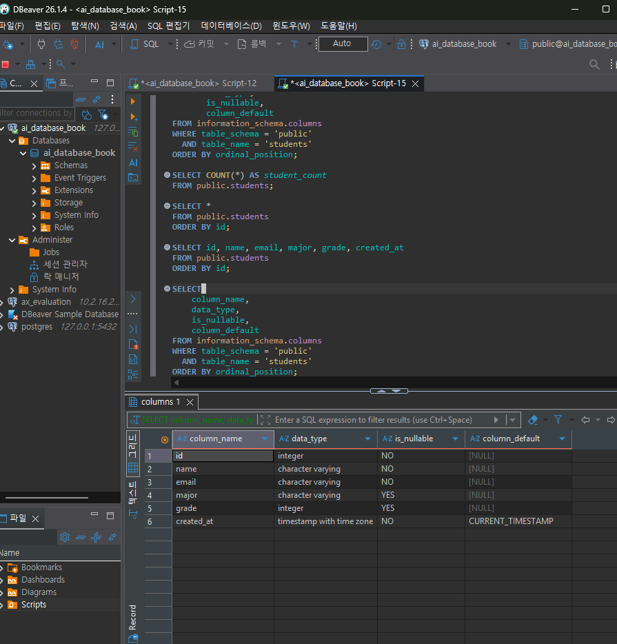
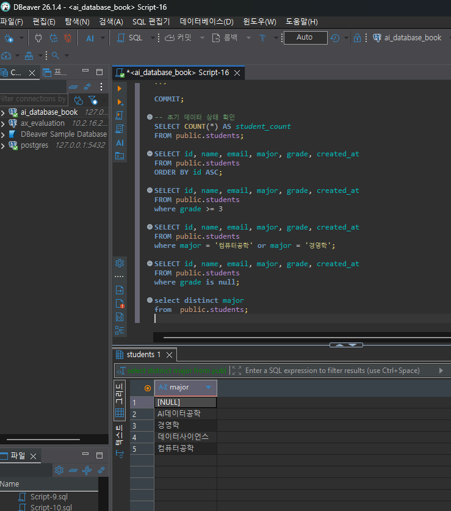
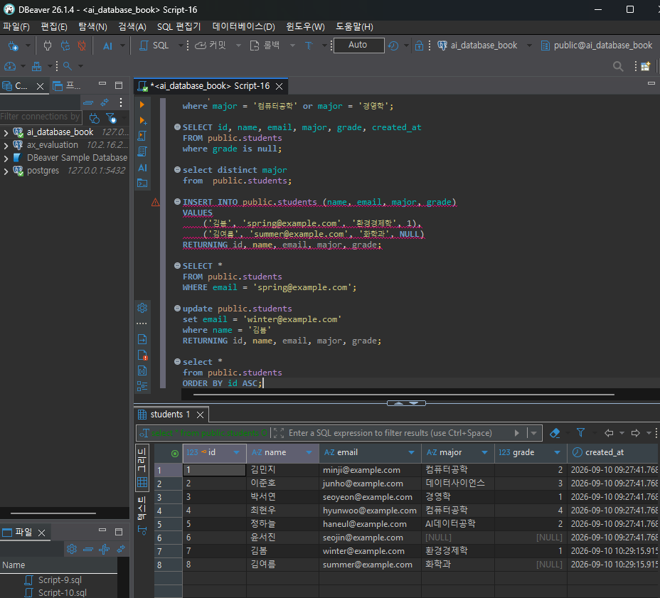
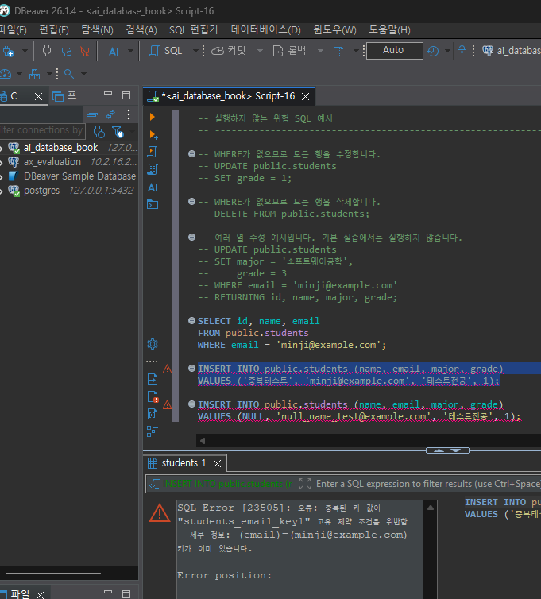

# Chapter 04 확장 실습 답안 템플릿

> **과제:** 관계형 데이터베이스와 SQL 시작하기  
> **사용 방법:** 이 파일을 내려받아 본인의 GitHub 저장소에 `chapter04_answer.md`라는 이름으로 저장한 뒤 실습하면서 바로 작성합니다.  
> **제출 방법:** LMS에는 파일을 직접 업로드하지 않고, **본인 GitHub 저장소의 `chapter04_answer.md` 파일 URL**을 제출합니다.

---

## 제출 전 주의

이 파일과 캡처 화면에는 실제 비밀번호, 전체 DB 접속 URL, API Key, 개인정보를 기록하지 않습니다.

```text
GitHub 계정 또는 별칭:darajeong
과제 작성일:26.09.09
사용한 AI 도구:GPT
```

---

# 1. 실습 환경과 시작 상태 확인

다음을 실행합니다.

```sql
SELECT current_database();
SELECT current_user;
SELECT current_schema();
SHOW search_path;
SHOW transaction_read_only;
```

| 확인 항목 | 실제 결과 | 의미 |
| --- | --- | --- |
| current_database() | ai_database_book | 현재 연결된 데이터베이스 이름 확인 |
| current_user | postgres | 현재 접속한 사용자 계정 확인 |
| current_schema() | public | 현재 기본으로 사용하는 스키마 확인 |
| search_path | "$user",public | 테이블을 찾을때 검색하는 스키마 순서 확인 |
| transaction_read_only | off | 현재 연결이 읽기 전용인지 확인 (off는 수정 가능, on은 읽기 전용) |

- [O] 현재 DB가 `ai_database_book`이다.
- [O] 변경 가능한 연결인지 확인했다.
- [O] 실행할 SQL 범위를 확인했다.
- [O] Auto-commit 상태를 확인했다.

### 변경 SQL을 실행하기 전에 현재 DB와 실행 범위를 확인해야 하는 이유

```text
잘못된 데이터베이스나 불필요하게 넓은 범위의 데이터를 수정/삭제하는 실수를 막기 위해서입니다.
```

---

# 2. `public.students` 구조 생성

## 2-1. 실행 전 예상

```text
테이블 이름: public.students
한 행의 의미: 학생 한명의 정보
예상 행 수: 0행
기본키: id
필수 열: id, name, email, created_at
중복을 막는 열: email
자동 생성 열: id, created_at
```

## 2-2. 실행 파일

```text
code/chapter04/01_create_students.sql
```

## 2-3. 실행 후 확인

```text
테이블 생성 성공 여부:Y
실제 행 수:0
DBeaver에서 확인한 위치:ai_database_book → Databases → ai_database_book → Schemas → public → Tables → students
```

### 각 열의 역할

| 열 | 타입 | NULL 가능? | 역할 |
| --- | --- | --- | --- |
| id | INTEGER | 불가능 | 학생을 구분하는 내부 식별자이자 기본키 |
| name | VARCHAR(50) | 불가능 | 학생 이름 저장 |
| email | VARCHAR(100) | 불가능 | 학생 이메일 저장 및 중복 방지 |
| major | VARCHAR(100) | 가능 | 학생 전공 저장 |
| grade | INTEGER | 가능 |학생 학년 저장  |
| created_at | TIMESTAMPTZ | 불가능 | 데이터가 생성된 날짜와 시간 저장 |

### `id`를 학번이나 학생 수로 해석하면 안 되는 이유

```text
id는 각 행을 구분하기 위해 데이터베이스가 자동으로 생성하는 내부 식별자이다. 데이터가 삭제되거나 입력에 실패하면 번호가 건너뛸 수 있으므로, id의 값이 전체 학생 수를 의미하지 않는다.
```

### 증거 화면

권장 경로:

```text
assignments/chapter04/images/step02_table.png
```

`여기에 테이블 구조 확인 화면을 삽입하세요.`

---

# 3. 샘플 데이터 6명 입력

## 3-1. 실행 전 예상

```text
현재 행 수:0
실행 후 예상 행 수:6
예상되는 NULL 포함 학생:1
```

## 3-2. 실행 파일

```text
code/chapter04/02_insert_students.sql
```

## 3-3. 실제 결과

```text
실제 행 수:6
이준호 grade:3
박서연 존재 여부:Y
윤서진 major:NULL
윤서진 grade:NULL
```

### 예상과 실제 비교

```text
예상과 실제가 일치했는가:Y
다르다면 이유:NA
```

### `created_at` 값이 여러 행에서 같을 수 있는 이유

```text
여러 학생 데이터를 하나의 트랜잭션에서 동시에 입력하면 CURRENT_TIMESTAMP가 같은 트랜잭션 시작 시간을 사용하기 때문에 여러 행의 created_at 값이 같을 수 있다. 따라서created_At 이나 id만 보고 실제 입력 순서나 업무 발생 시간을 단정하면 안 된다.
```

---

# 4. SELECT 복습과 결과 검증

각 문제는 **SQL 실행 전에 예상 행 수를 먼저 작성**합니다.

| 번호 | 조회 문제 | 예상 행 수 | 실제 행 수 | 일치? | 다르면 이유 |
| ---: | --- | ---: | ---: | --- | --- |
| 1 | 전체 학생 | 6 | 6 | Y | NA |
| 2 | 이름·이메일만 조회 | 6 | 6 | Y | NA |
| 3 | 특정 전공 (컴공) | 2 | 2 | Y | NA |
| 4 | 특정 학년 이상 (3학년) | 2 | 2 | Y | NA |
| 5 | (컴공or경영학) | 3 | 3 | Y | NA |
| 6 | `grade IS NULL` | 1 | 1 | Y | NA |
| 7 | 전공 `DISTINCT` | 1 | 1 | Y | NA |
| 8 | 정렬 후 상위 3명 | 3 | 3 | Y | NA |

## 4-1. 내가 직접 작성한 SQL 2개

```sql
-- SQL 1
SELECT id, name, email, major, grade, created_at
FROM public.students
where grade >= 3
```

```text
이 SQL의 한 행 의미:
예상 행 수:2
실제 행 수:2
```

```sql
-- SQL 2
SELECT id, name, email, major, grade, created_at
FROM public.students
where major = '컴퓨터공학' or major = '경영학';
```

```text
이 SQL의 한 행 의미:
예상 행 수:3
실제 행 수:3
```

## 4-2. `= NULL` 대신 `IS NULL`을 사용하는 이유

```text
NULL은 값이 없거나 알 수 없는 상태를 의미하므로 일반 값처럼 = 연산자로 비교할 수 없다. grade=NULL의 비료 결과는 참이나 거짓이 아니라 UNKNOWN이 되어 행이 조회되지 않는다. 따라서 값이 NULL인지 확인할 때는 greade IS NULL을 사용해야 한다.
```

## 4-3. `ORDER BY` 없이 결과 순서를 믿으면 안 되는 이유

```text
SQL에 입력한 순서대로 나올 수 있기 때문에 ORDER BY라는 정렬 구문없이 결과순서를 믿으면 안된다.
->ORDER BY를 사용하지 않은 조회 결과는 행의 출력 순서가 보장되지 않는다. 현재는 입력 순서대로 보이더라도 데이터베이스의 실행 계획이나 데이터 상태에 따라 순서가 달라질 수 있으므로, 특정 순서가 필요하면 반드시 ORDER BY를 사용해야 한다.
```

## 4-4. `DISTINCT`가 원본 데이터를 삭제하는 기능인가요?

```text
아니요. 원본데이터를 삭제하는 기능은 DELETE이고, DISTICT는 조회 결과에서 중복된 값을 한번만 보여주는 기능입니다.
-> 아니요. 원본 데이터를 삭제하는 명령어는 DELETE이고, DISTINCT는 원본 데이터를 변경하지 않고 조회 결과에서 중복된 값을 한 번만 보여주는 기능입니다.
```

### 증거 화면

권장 경로:

```text
assignments/chapter04/images/step04_select.png
```

`여기에 SELECT 핵심 결과 화면을 삽입하세요.


---

# 5. 내 가상 학생 2명 추가

실명·실제 이메일 대신 가상 데이터를 사용합니다.

## 5-1. 실행 전 계획

```text
학생 A
이름:김봄
이메일:spring@example.com
전공:환경경제학
학년:1

학생 B
이름:김여름
이메일:summer@example.com
전공:화학과
학년 또는 NULL:NULL

현재 행 수:6
추가 후 예상 행 수:8
```

## 5-2. 내가 실행한 INSERT

```sql
INSERT INTO public.students (name, email, major, grade)
VALUES
    ('김봄', 'spring@example.com', '환경경제학', 1),
    ('김여름', 'summer@example.com', '화학과', NULL)
RETURNING id, name, email, major, grade;
```

## 5-3. 실제 결과

```text
RETURNING 또는 확인 SELECT 결과:2
실제 전체 행 수:8
예상과 일치 여부:일치
```

### 내가 일부 값을 NULL로 둔 이유 또는 NULL을 사용하지 않은 이유

```text
김여름 학생의 학년 정보는 아직 정해지지 않았다고 가정하여 NULL로 입력했다. 이름, 이메일, 전공은 알고 있는 정보이므로 NULL을 사용하지 않았다. 김봄 학생은 모든 정보가 정해져 있어 NULL을 사용하지 않았다.
```

---

# 6. 안전한 UPDATE

내가 추가한 가상 학생 한 명만 수정합니다.

## 6-1. 먼저 대상 확인 SELECT

```sql
SELECT *
FROM public.students
WHERE email = 'spring@example.com';
```

```text
예상 대상 행 수:1
실제 대상 행 수:1
```

## 6-2. UPDATE

```sql
update public.students
set email = 'winter@example.com'
where name = '김봄'
RETURNING id, name, email, major, grade;
```

```text
예상 영향 행 수:1
실제 영향 행 수:1
RETURNING 결과:김봄 학생의 이미엘이 변경됨
```

## 6-3. UPDATE 후 재조회

```sql
select *
from public.students
ORDER BY id ASC;
```

### `WHERE` 없는 UPDATE를 실행하면 위험한 이유

```text
모든 열이 수정될 수 있다.
->WHERE 조건 없이 UPDATE를 실행하면 특정 학생 한 명이 아니라 테이블의 모든 행이 수정된다. 따라서 UPDATE를 실행하기 전에 같은 WHERE 조건으로 SELECT하여 대상과 행 수를 확인해야 한다.
```

### 증거 화면

권장 경로:

```text
assignments/chapter04/images/step06_update.png
```

`여기에 UPDATE 전/후 결과 화면을 삽입하세요.`

---

# 7. 안전한 DELETE

내가 추가한 가상 학생 한 명을 삭제합니다.

## 7-1. 삭제 전 확인

```sql
select *
from public.students
where name = '김여름';
```

```text
예상 대상 행 수:1
실제 대상 행 수:1
```

## 7-2. DELETE

```sql
delete from public.students 
where name = '김여름'
RETURNING id, name, email, major, grade;
```

```text
예상 영향 행 수:1
실제 영향 행 수:1
RETURNING 결과:김여름, summer@example.com
```

## 7-3. 삭제 후 재조회

```sql
select *
from public.students
ORDER BY id ASC;
```

```text
삭제 후 같은 조건의 SELECT 결과 행 수:7
```

### `DELETE` 성공 메시지만 보고 끝내지 않고 다시 SELECT해야 하는 이유

```text
모든 데이터가 날라가지는 않았는지 확인하기 위해서. 
->DELETE 문이 오류 없이 실행되었더라도 의도한 데이터가 정확하게 삭제되었는지 확신할 수 없기 때문이다. 같은 WHERE 조건으로 다시 SELECT하여 삭제 대상이 실제로 0행이 되었는지 확인해야 한다.
```

---

# 8. 본문 기준 UPDATE·DELETE 상태 검증

`04_update_delete_students.sql`을 본문 시작 상태에서 실행했다면 다음을 확인합니다.

```text
최종 학생 수:6
이준호 grade:3
박서연 존재 여부:Y
```

본문 기준 기대 상태와 비교합니다.

```text
학생 수 = 5
이준호 grade = 4
박서연 = 0행
```

### 내 실제 결과가 기준과 다르다면 원인

```text
해당사항 없음
```

---

# 9. 의도한 실패 2개 관찰

> 실패 테스트는 데이터베이스 규칙이 실제로 데이터를 보호하는지 확인하는 실험입니다.

## 9-1. 중복 이메일 `UNIQUE` 오류

내가 사용한 SQL:

```sql
INSERT INTO public.students (name, email, major, grade)
VALUES ('중복테스트', 'minji@example.com', '테스트전공', 1);
```

```text
오류 메시지 핵심 단서: 오류: 중복된 키 값이 "students_email_key1" 고유 제약 조건을 위반함
  세부 정보: (email)=(minji@example.com) 키가 이미 있습니다.
왜 실패해야 맞는가: 이미 사용 중인 이메일을 다시 입력했기 때문에 실패해야 한다.
어떤 규칙이 작동했는가: email 열의 UNIQUE 제약조건이 작동했다.
실패 후 기존 데이터가 어떻게 유지되었는가: 중복 데이터는 추가되지 않았으며 기존 학생 데이터는 그대로 유지되었다.
```

## 9-2. 이름 `NULL` 입력 `NOT NULL` 오류

내가 사용한 SQL:

```sql
INSERT INTO public.students (name, email, major, grade)
VALUES (NULL, 'null_name_test@example.com', '테스트전공', 1);
```

```text
오류 메시지 핵심 단서:오류: "name" 칼럼(해당 릴레이션 "students")의 null 값이 not null 제약조건을 위반했습니다.
왜 실패해야 맞는가:학생 이름은 반드시 입력해야 하는 필수 값인데 NULL을 입력했기 때문이다.
어떤 규칙이 작동했는가:name 열의 NOT NULL 제약조건이 작동했다.
```

### 실패한 INSERT 뒤 자동 생성 `id` 번호에 빈 구간이 생길 수 있어도 문제라고 단정할 수 없는 이유

```text
id는 학생 수를 의미하는 것이 아니다. 자동으로 할당 된 것이어서 중간에 데이터를 삭제하고 다른 데이터를 입력하였다면 +1씩 증가하기때문에 빈 구간이 생길 수 있다
-> id는 학생 수나 입력 성공 횟수가 아니라 각 행을 구분하는 내부 식별자이다. INSERT를 시도하는 과정에서 자동 번호가 먼저 할당된 뒤 제약조건 오류로 입력이 실패하면 해당 번호가 다시 사용되지 않을 수 있다. 따라서 id에 빈 번호가 있어도 데이터 오류라고 단정할 수 없다.
```

### 증거 화면

권장 경로:

```text
assignments/chapter04/images/step09_constraint_error.png
```

`여기에 제약조건 오류 화면을 삽입하세요.`

---

# 10. `verify_students.sql`로 최종 상태 확인

실행 파일:

```text
code/chapter04/verify_students.sql
```

```text
현재 전체 학생 수:5
NULL 개수:2
이준호 grade:4
박서연 존재 여부:N
현재 데이터 상태에서 예상과 다른 부분:없음
```

### 검증 SQL을 따로 두면 좋은 이유

```text
실수할때를 대비해서 검증 SQL을 따로 두면 좋다.
->SQL이 오류 없이 실행되었다는 사실만으로 테이블의 구조와 데이터가 예상한 상태라고 확신할 수 없기 때문이다. 검증 SQL을 따로 두면 전체 행 수, NULL 개수, 특정 학생의 수정·삭제 여부 등을 반복해서 확인하여 최종 결과가 기대 상태와 일치하는지 판단할 수 있다.
```

---

# 11. AI를 SQL 작성자가 아니라 검토자로 활용

먼저 본인이 SQL을 작성한 뒤 AI에게 검토를 요청합니다.

## 11-1. 내가 작성한 SQL

```sql
UPDATE public.students
SET grade = 1
WHERE email = 'seojin@example.com';
```

## 11-2. AI에게 전달한 핵심 요청

```text
나는 PostgreSQL 초보자입니다. 아래 UPDATE SQL의 안전성을 검토해 주세요.

1. 영향을 받을 것으로 예상되는 행 수
2. WHERE 조건이 충분히 구체적인지
3. 실행 전에 대상을 확인할 SELECT
4. 실행 후 결과를 확인할 SELECT
5. 놓친 위험이 있는지

UPDATE public.students
SET grade = 1
WHERE email = 'seojin@example.com';
```

## 11-3. AI 검토 결과

| AI 제안 | 수용 / 수정 / 거절 | 실제 검증 결과 | 나의 이유 |
| --- | --- | --- | --- |
| 실행 전에 같은 이메일 조건으로 SELECT하기 | 수용 | 대상 학생이 1행임을 확인 | 다른 학생을 잘못 수정하는 것을 방지할 수 있기 때문 |
| 중복이 제한된 이메일을 WHERE 조건으로 사용하기 | 수용 | seojin@example.com과 일치하는 행이 1개였음 | 이름보다 이메일이 학생 한 명을 구분하기에 안전하기 때문 |
| RETURNING으로 수정 결과 확인하기 | 수용 | 윤서진의 grade가 1로 변경됨 | 윤서진의 grade가 1로 변경됨 |수정된 행과 값을 실행 직후 확인할 수 있기 때문

### AI가 예상한 영향 행 수와 실제 결과가 같았나요?

```text
같았다. AI는 이메일 조건과 일치하는 학생 1행이 수정될 것으로 예상했고, 실행 전 SELECT와 UPDATE의 RETURNING 결과에서도 실제 대상이 1행임을 확인했다.
```

### AI 답변을 실행 전에 검토해야 하는 이유

```text
AI가 데이터베이스의 현재 데이터 상태를 정확히 알지 못하거나 너무 넓은 WHERE 조건을 제안할 수 있기 때문이다. 따라서 AI가 작성하거나 검토한 SQL도 바로 실행하지 않고, 같은 조건의 SELECT로 대상과 예상 행 수를 직접 확인해야 한다.
```

---

# 12. 내 서비스 테이블 하나 확장 설계

Chapter 01~03에서 정한 개인 서비스에서 **테이블 하나**를 선택합니다.

```text
서비스 이름:학생상담서비스
테이블 이름:consultations
한 행의 의미:학생에게 제공되는 상담 일정 한 건
```

| 열 이름 | 저장할 값 | 타입 후보 | NULL 가능? | UNIQUE 후보? | 이유 |
| --- | --- | --- | --- | --- | --- |
| consultation_id |상담 내부 식별번호 | INTEGER | 불가능 | Y | 상담 한 건을 구분하는 기본키 |
| title | 상담 제목 |VARCHAR(100)  | 불가능 | N | 여러 상담의 제목이 같을 수 있음 |
|content  | 상담 내용 또는 설명 | TEXT |가능  | N | 상담 개설 시 내용이 미정일 수 있음 |
| content | 상담 내용 또는 설명 | TEXT | 가능 | N | 상담 개설 시 내용이 미정일 수 있음 |
| scheduled_at | 상담 예정 일시 | TIMESTAMPTZ | 불가능 | N | 같은 시간에 여러 상담이 진행될 수 있음 |

```text
PK 후보:consultation_id
업무 식별자 후보:아직 정하지 않음
아직 미확정인 규칙:상담 상태 종류, 상담 시간, 1명의 상담사가 동일 시간에 여러 학생과 상담 허용 여부, 상취소 상담 보관 여부 
```

## 선택: CREATE TABLE 초안

> 아직 확정되지 않은 업무 규칙은 억지로 제약조건으로 만들지 않습니다.

```sql
CREATE TABLE counseling.consultations (
    consultation_id INTEGER
        GENERATED BY DEFAULT AS IDENTITY
        PRIMARY KEY,

    title VARCHAR(100)
        NOT NULL,

    content TEXT,

    scheduled_at TIMESTAMPTZ
        NOT NULL,

    instructor_id INTEGER,

    status VARCHAR(20)
        NOT NULL,

    created_at TIMESTAMPTZ
        NOT NULL DEFAULT CURRENT_TIMESTAMP
);
```

### AI에게 검토받은 뒤 수정한 부분

```text
앞에서 정한 학생 상담 서비스의 테이블 후보와 일치하도록 테이블 이름을 consultations로 정하였다. 상담 제목은 중복될 수 있으므로 UNIQUE를 지정하지 않았고, 담당 강사가 나중에 배정될 가능성을 고려하여 instructor_id에는 NULL을 허용하였다. 상담 상태의 종류와 중복 일정 허용 여부는 아직 확정되지 않았으므로 CHECK나 UNIQUE 제약조건을 추가하지 않았다.
```

---

# 13. 최종 성찰

아래 문장은 본인의 말로 작성합니다.

```text
1. SQL 실행 성공과 올바른 대상 선택이 다른 이유는
   다른 부분이 실행되었거나 조건을 입력하지 않고 실행되었을 수도 있기때문 이다.
   ->SQL 문법이 맞아 정상적으로 실행되었더라도 WHERE 조건이 잘못되면 의도하지 않은 행이 선택되거나 변경될 수 있기 때문이다.

2. UPDATE와 DELETE 전에 SELECT를 먼저 해야 하는 이유는
   수정되지 말아야 할 부분이 모두 또는 부분 수정될 수 있기 때문이다.
   -> 같은 WHERE 조건으로 변경될 데이터를 미리 조회하여 수정하거나 삭제하면 안 되는 행까지 포함되지 않았는지 확인하기 위해서이다.


3. 영향받은 행 수를 확인해야 하는 이유는
   내가 수정하고자 했던 부분이 영향받았는지 중복 확인해야하기 때문이다.
   -> 실제로 변경된 행 수가 실행 전에 예상한 행 수와 같은지 비교하여 SQL이 의 잘못된 범위에 적용되지 않았는지 확인하기 위해서이다.


4. UNIQUE 또는 NOT NULL 오류를 '보호 장치가 정상 동작한 결과'라고 볼 수 있는 이유는
   한번더 확인할 수 있기 때문 이다.
   -> UNIQUE 제약조건은 중복값을 막고, NOT NULL 제약조건은 필수값이 빠진 데이터가 입력되지 않도록 막아 데이터의 정확성을 보호하기 때문이다.


5. AI가 SQL을 만들어 주더라도 내가 반드시 확인해야 하는 것은
   결과값 이다.
   ->현재 데이터베이스와 테이블, 대상, WHERE 조건, 예상 영향 행 수 및 실행 후 실제 결과이다.
```

---

# 14. 제출 체크리스트

- [O] `chapter04_answer.md`를 본인 저장소에 만들었다.
- [O] 현재 DB와 실행 환경을 확인했다.
- [O] `public.students`를 생성했다.
- [O] 샘플 6명 입력 결과를 검증했다.
- [O] SELECT 문제에서 실행 전 예상 행 수를 작성했다.
- [O] 가상 학생 2명을 추가했다.
- [O] UPDATE 전후를 SELECT로 확인했다.
- [O] DELETE 전후를 SELECT로 확인했다.
- [O] UNIQUE 오류를 관찰했다.
- [O] NOT NULL 오류를 관찰했다.
- [O] `verify_students.sql`로 상태를 확인했다.
- [O] AI 제안을 실제 SQL 결과와 비교했다.
- [O] 개인 서비스 테이블 하나를 확장 설계했다.
- [O] 핵심 캡처는 3~4장 정도로 제한했다.
- [O] 비밀번호·개인정보가 캡처에 없다.
- [O] Markdown 이미지가 GitHub 웹 화면에서 정상 표시된다.
- [O] commit/push를 완료했다.

---

# 15. LMS 제출 URL

아래 형식의 **본인 GitHub 파일 URL**을 LMS에 제출합니다.

```text
https://github.com/<본인-GitHub-ID>/<본인-저장소>/blob/main/assignments/chapter04/chapter04_answer.md
```

내 제출 URL:

```text
https://github.com/darajeong/ai-database-study/blob/main/assignments/chapter04/chapter04_answer.md
```

> 교수자 템플릿 URL이나 저장소 메인 URL이 아니라 **작성 완료된 본인 `chapter04_answer.md` 파일 화면 URL**을 제출합니다.
